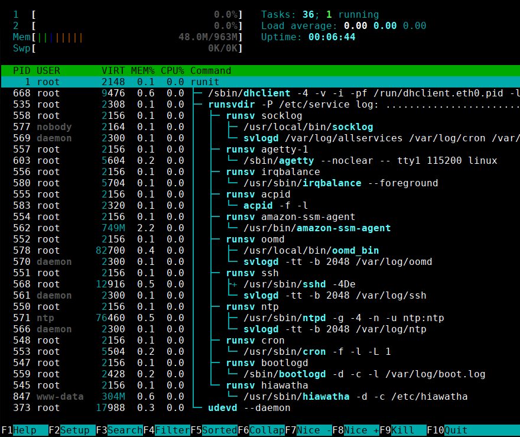

# Devuan + Runit for Amazon EC2

>"Do one thing, do it well."
><cite> - [Doug McIllroy](https://en.wikipedia.org/wiki/Unix_philosophy#Do_One_Thing_and_Do_It_Well)</cite>

>"Do everything, do it in PID1"
><cite> - [systemd](https://ewontfix.com/14/)</cite>

## About

This project aims to provide a viable alternative to the systemd-monotheistic AWS offering. The goal is to track progress and maintain documentation for a fast, stable and secure general-purpose operating system for [Amazon EC2](https://aws.amazon.com/ec2/).

[Devuan](https://devuan.org/os/) seems to be the [practical and stable](https://blog.ungleich.ch/en-us/cms/blog/2017/12/10/the-importance-of-devuan/) choice for administrators running servers in datacenters. Devuan [Ascii](https://devuan.org/os/releases), which runs SysVinit by default, was modified to use [Runit](http://smarden.org/runit/) instead. All changes regarding this switch are in this repository. Most of the code is directly applicable to other standalone Devuan-based distributions outside the cloud environment.

---
## Why bother?

>The crowd pushing systemd, possibly including its author, is not content to have systemd be one choice among many. By providing public APIs intended to be used by other applications, systemd has set itself up to be difficult not to use once it achieves a certain adoption threshold. Its popularity is purely the result of an aggressive, dictatorial marketing strategy including engulfing other essential system components, setting up for API lock-in, and dictating policy... at the expense of flexibility and diversity.
>
><cite>\- [Rich Felker](https://ewontfix.com/14/), author of [musl](http://www.musl-libc.org/faq.html) library</cite>

The development progress of systemd seems to closely resemble the well-known "[embrace, extend, extinguish](https://en.wikipedia.org/wiki/Embrace,_extend,_and_extinguish)" strategy formerly used by Microsoft. Whether intentional or not, this can arguably lead to a dangerous situation. systemd has shown to be unstable, [prone to crashes](https://www.agwa.name/blog/post/how_to_crash_systemd_in_one_tweet), and its developers approach to security is [famous for being lame](https://www.theregister.co.uk/2017/07/28/black_hat_pwnie_awards/). 

systemd became the single most widespread Linux init system. And it doesn't just do init, it also does login, pam, getty, syslog, udev, cryptsetup, cron, at, dbus, acpi, gnome-session, autofs, tcpwrappers, audit, chroot, mount([1](https://systemd-free.org)), network management, DNS, Firewall, UEFI([2](http://without-systemd.org/wiki/index.php/Arguments_against_systemd#Scope_creep)), su([3](https://linux.slashdot.org/story/15/08/29/1526217/systemd-absorbs-su-command-functionality)), HTTP server([4](https://www.freedesktop.org/software/systemd/man/systemd-journal-gatewayd.service.html)) ... and on saturdays it also does your laundry. Adopted by all major distributions, there seems to be no real alternative, pushing the Linux base further towards a monoculture environment. systemd is not just a default software choice. Many packages depend directly on it, which makes it IMPOSSIBLE to remove or switch to something else later on. Once you run an OS with systemd, that's it, you're stuck with it, for better or worse, so help you God. And even if you use systemd on a daily basis and everything goes well, you might want to have some alternative. Just in the case that something breaks someday. So, what alternatives are available?

### EC2 Linux AMI Comparison

Free-Tier Eligible general purpose GNU/Linux systems on AWS, as of 2018-02:

| AMI Name | [Init System](https://devuan.org/os/init-freedom/) | Category | Packages | EBS Size*1 | Boot Time*2 ([&pm;SD](https://en.wikipedia.org/wiki/Standard_deviation)) | License | 
| :---  | :--- | :--- | :--- | :--- | :--- | :--- |
| Amazon Linux AMI 2017.09.1 | systemd | Quick Start | rpm | 8 GB | 11.8&nbsp;s&nbsp;(&pm;0.8) | [EULA](https://aws.amazon.com/agreement/) |
| Amazon Linux 2 LTS Candidate AMI 2017.12.0 | systemd | Quick Start | rpm | 8 GB | 30.2&nbsp;s&nbsp;(&pm;1.6) | [EULA](https://aws.amazon.com/agreement/) |
| Red Hat Enterprise Linux [7.4](https://access.redhat.com/articles/3135091) | systemd | Quick Start | rpm | 10 GB | 20.4&nbsp;s&nbsp;(&pm;1.7) | [EULA](https://www.redhat.com/en/about/agreements) |
| SUSE Linux Enterprise Server 12 SP3 | systemd | Quick Start | rpm | 10 GB | 46.4&nbsp;s&nbsp;(&pm;0.5) | [EULA](https://www.suse.com/company/legal/#c), [Terms](https://www.suse.com/products/terms_and_conditions.pdf) |
| Ubuntu Server 16.04 LTS | systemd | Quick Start | apt | 8 GB | 16.8&nbsp;s&nbsp;(&pm;1.1) | [EULA](https://www.ubuntu.com/legal/terms-and-policies/intellectual-property-policy)|
| CentOS 7 | systemd | Marketplace | rpm | 8 GB | 21.2&nbsp;s&nbsp;(&pm;1.1) | Free |
| Debian GNU/Linux 9.3 Stretch | systemd | Marketplace | apt | 8 GB | 8.0&nbsp;s&nbsp;(&pm;0.7) | [Free](https://d7umqicpi7263.cloudfront.net/eula/product/572488bb-fc09-4638-8628-e1e1d26436f4/060496c2-9fe5-4a95-9ab6-0ff2f7abb669.txt) |
| **Devuan Ascii 2018-02-14** | [**Runit**](https://en.wikipedia.org/wiki/Runit) | **Community** | **apt** | **4 GB** | **5.1&nbsp;s**&nbsp;(&pm;0.8) | [**Free**](https://devuan.org/os/free-software) |

\*1) Smallest possible volume storage size for a new instance  
\*2) Determined by [ec2-benchmark-osboot.sh](tools/ec2-benchmark-osboot.sh), on _t2.micro_ in _us-east-1a_, averaged 5 consecutive runs

This is not a comprehensive comparison, some OS might disqualify for other reasons, like their limited [instance type](https://aws.amazon.com/ec2/instance-types/) support. While [Gentoo](https://gentoo.org) uses [OpenRC](https://wiki.gentoo.org/wiki/OpenRC) and not systemd, most of the Gentoo AMIs are limited to just a few instance types, therefore it's not considered a general-purpose system on EC2 and is not included in the comparison (also, the latest version doesn't run on t2.micro). However, if it works for your use case, Gentoo is definitely worth a try.

All major Linux distributions already transitioned to systemd. If you want to use something else on Amazon EC2, you are pretty much out of luck. This is where the **Devuan Ascii + Runit** distribution comes in:

---
## Features

Currently available Devuan AMI offers:

 * [**Runit**](http://smarden.org/runit/) as init and service supervisor
 * Small footprint with only **4 GB** minimal EBS volume size
 * Fast direct boot **without Initrd**
 * [cloud-init](https://cloud-init.io) v0.7.9
 * Custom [compiled](tools/kernel-update.sh) stable kernel from https://www.kernel.org
    * Included network drivers Amazon ENA v1.3.0K (25Gb) + Intel 82599 ixgbevf 4.1.0-k (10Gb)
 * Easily configurable logging, with all logs being textfiles in _/var/log_
    * _[svlogd](http://smarden.org/runit/svlogd.8.html)_ used for services writing to stdout (e.g. ssh)
    * _[socklog](http://smarden.org/socklog/)_ used for socket logging (e.g. dhclient or cron)
 * Preinstalled [Hiawatha](https://www.hiawatha-webserver.org) v10.7, advanced and secure webserver

_NOTE:_ not everybody wants to run a webserver. However, for convenience, Hiawatha is preinstalled since it is not directly available from the main repository. If you don't need a webserver, or wish to use a different one, you can easily deactivate the Hiawatha service, see [service management](#runit-service-management).

### Changes

The main setup differences compared to a clean Devuan installation. These mainly address runit compatibility with Devuan and AWS cloud environment integration.

#### Preinstalled tools from Devuan repository

    # apt-get install acpid apache2-utils aptitude certbot cpulimit curl dnsutils ethtool eudev fuse gawk htop incron iptraf kexec-tools lsof lynx mc ncdu ncftp nfs-common nfswatch nfstrace ntp p7zip-full pciutils pigz php php-cgi procmail pwgen rename runit screen sntop ssmtp sysv-rc-conf telnet whois

#### Compiled from source

 * Linux stable kernel (https://www.kernel.org), see [kernel-update.sh](tools/kernel-update.sh)
 * Hiawatha webserver (http://www.hiawatha-webserver.org), see [hiawatha-update.sh](tools/hiawatha-update.sh)
 * Socklog (http://smarden.org/socklog/install.html)
 * [ec2-metadata](https://aws.amazon.com/code/ec2-instance-metadata-query-tool/) query tool, see [ec2-update.sh](tools/ec2-update.sh)

Sources are placed in _/usr/src_ and _/root/inst_ inside the AMI.

---
## Installation

**"Devuan Ascii YYYY-MM-DD (Unofficial)"** AMIs are available in the Amazon EC2 **us-east-1** region in the **Community AMIs** category. This git repository serves as documentation and development base for Devuan AMIs inside AWS EC2, and cannot be directly used for AWS management, installation, or upgrades.

Why **'Unofficial'**: This project is not affiliated with the official Devuan GNU/Linux distribution in any way.

---
## Usage

A few useful commands to get you up and running. These Runit scripts are universal, and work well outside the cloud environment.

### Login

 * The default SSH user is **admin**
 * For an easy access, use [ssh-login.sh](tools/ssh-login.sh)  
   or use the command `ssh -i INSTANCE-KEY.pem admin@INSTANCE-IP`

### Shutdown and reboot

 * `shutdown` - simple immediate halt and power off. Does not accept any parameters.
 * `reboot` - immediate system reboot
 * `reboot soft` - reboot quickly without waiting for BIOS, see [kexec](http://horms.net/projects/kexec/)
 
### Runit service management

In addition to standard Runit [service control](http://smarden.org/runit/sv.8.html), these commands were added for convenience:

 * [svactivate](etc/runit/svactivate) - include and start services in Runit supervisor
 * [svdeactivate](etc/runit/svdeactivate) - stop service and disable supervision
 * [runit-core-install](etc/runit/runit-core-install) - integrate Runit into the system  
   Useful after OS upgrade to keep commands like _reboot_ and _shutdown_ to work properly.

### System Updates

 * [kernel-update.sh](tools/kernel-update.sh) - download, compile and install new Linux kernel from kernel.org
 * [hiawatha-update.sh](tools/hiawatha-update.sh) - download, compile and install new Hiawatha webserver
 * [hiawatha-certbot.sh](tools/hiawatha-certbot.sh) - refresh letsencrypt certificates managed by [certbot](https://certbot.eff.org/#devuanother-other)

---
## ToDo

 * Include the _amazon-ssm-agent_ (https://github.com/aws/amazon-ssm-agent)
 * Automate AMI propagation to all EC2 regions (currently us-east-1 only)
 * Create clean [VOID](https://www.voidlinux.eu) AMI from scratch, as an additional alternative distribution
 * ~~Speed up boot process, remove initrd~~ DONE
 * ~~Customize kernel, replace Devuan stock with stable branch from kernel\.org~~ DONE

---

## License

This work is free. You can redistribute it and/or modify it under the terms of the Do What The Fuck You Want To Public License, Version 2, as published by Sam Hocevar. See http://www.wtfpl.net for more details. If you feel that releasing this work under WTFPL is not appropriate, since some of the code might be derivative and thus possibly breaking some other license... just do WTF you want to.

### Trademarks
"AWS" and "Amazon EC2" are registered trademarks of Amazon\.com Inc., "Devuan" is a registered trademark of the Dyne\.org foundation, "Debian" is a registered trademark of Software in the Public Interest Inc., "Ubuntu" is a registered Trademark of Canonical Inc.,  "SuSE" is a registered trademark of SUSE IP Development Ltd., Red Hat is a trademark or registered trademark of Red Hat Inc. or its subsidiaries, Linux is a registered trademark of Linus Torvalds. All other possibly and impossibly mentioned trademarks are the property of their respective owners.

---
## Author

This repository is maintained by _cloux@rote.ch_

### Disclaimer

I am not involved in the development, nor in any way affiliated with any particular init system. I do not participate in any discussion or flamewar about init. I am not a fanboy, nor a hater. I do not have any personal feelings towards any init, or any other software, or it's developers. As a sysadmin, I could not care less which init system is in use. As long as it works. And in the case it doesn't, I want to have a solid alternative available. Also, I do not claim fitness of this project for any particular purpose, and do not take any responsibility for it's use. You should always choose your system and all of it's components very carefully, if something breaks it's on you. See [license](#license).

_NOTE:_ Much of the Runit base structure is "borrowed" from the [void-runit](https://github.com/voidlinux/void-runit), and modified to integrate with Devuan inside cloud environment.

### Contributing

I will keep this project alive as long as I can, and as long as there is some interest. This is however a private project, so my support is fairly limited. Any help with further development, testing, and bugfixing will be appreciated. If you want to report a bug, please either [raise an issue](https://github.com/cloux/aws-devuan/issues), or fork the project and send me a pull request.

### Thanks to

 * Devuan Project: https://devuan.org
 * Void Linux: https://www.voidlinux.eu
 * Runit and Socklog author Gerrit Pape: https://smarden.org/pape
 * Hiawatha author Hugo Leisink: https://www.hiawatha-webserver.org
 * Flussence: https://gitlab.com/flussence/runit-scripts

---